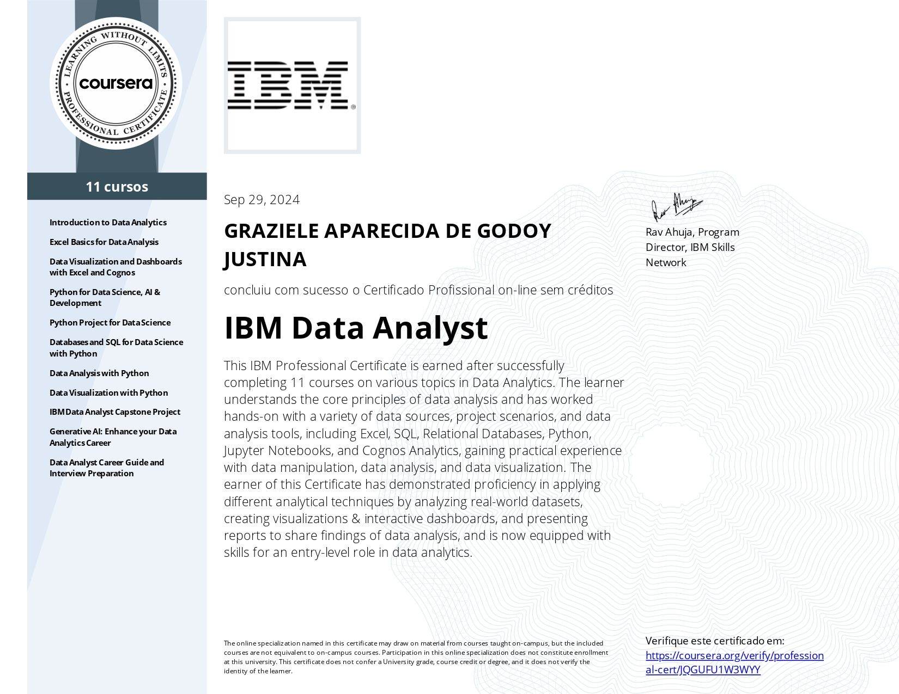
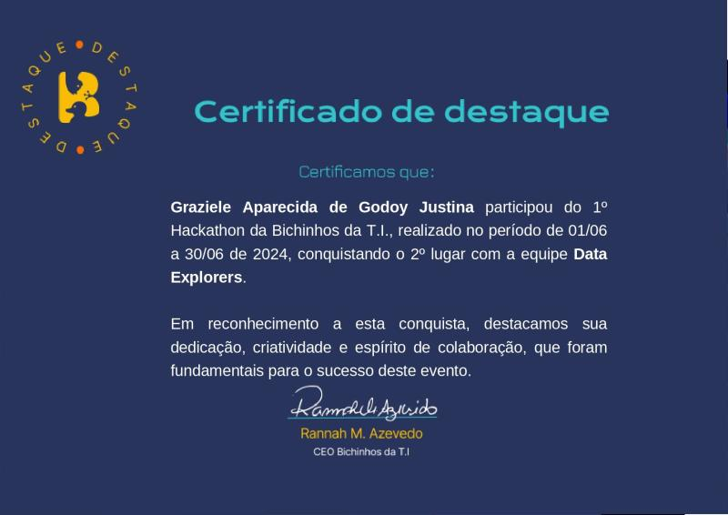

<h1 align="center">Graziele Aparecida de Godoy Justina</h1>

  

# Bem vindos ao meu perfil do GitHub

Sou uma Analista de Dados Júnior apaixonada por análises e por transformar dados em insights valiosos que geram valor para as empresas. Possuo experiência em planejamento estratégico, análise de desempenho e de indicadores, e na criação de relatórios gerenciais e operacionais, ajudando as organizações a tomarem decisões estratégicas e orientada por dados, impulsionando resultados para as empresas.

Tenho experiência em liderar equipes e gerenciar projetos, aplicando metodologias ágeis para garantir soluções assertivas e eficazes. Sou certificada como Analista de Dados pela IBM, e minhas habilidades em Data Driven e DataOps me capacitam a gerar insights que resultam em ações para melhorar o desempenho das empresas.

Possuo habilidades em SQL, Power BI, Excel e Python, com foco em desenvolver soluções de análise de dados voltadas para negócios, sempre com o objetivo de gerar valor as empresas. Tenho interesse em áreas como dados, business intelligence, negócios, e planejamento estratégico, onde aplico minha visão analítica e técnicas para resolver problemas empresariais.

Minha expertise inclui:

🚀 Soft skills

- Capacidade analítica, Tomada de decisão, Conhecimento de negócio, Gestão de projetos, Comunicação, Resolução de problemas, Trabalho em equipe, Modelagem e Análise de Dados, Mapeamento de Dados, Prototipação, Data Driven, DataOps, Storytelling, Product Discovery, Metodologias Ágeis, OKR e KPI, Homologação, Criação de Dashboards, LGPD e Documentação.

🛠️ Hard Skills:

- Excel, SQL, Python, Power BI, Google Looker Studio, Cognos Analytics, Figma, Databricks, GitHub, Git, BigQuery, Google Sheets, Google Analytics, ETL, IA Generativa e IBM Cloud.

### Certificações e destaques

**Certificação Profissional**:Certificada como Analista de Dados da IBM, pela instituição Coursera em 2024.

**Destaque**: Certificado de Destaque pelo 2º lugar em um Hackathon da Edtech Bichinhos da TI, onde atuei como Tech Lead, com foco em liderança técnica, coordenação de projetos e desenvolvimento de soluções.

---

### Contatos:

* WhatsApp: (14) 99722-6510
* Email: grazielejustina@hotmail.com
* Linkedin: [**Link**](https://www.linkedin.com/in/grazielejustina/)
* Portfólio de projetos: [**Link**](https://github.com/grazielejustina/portfolio-de-projetos)
